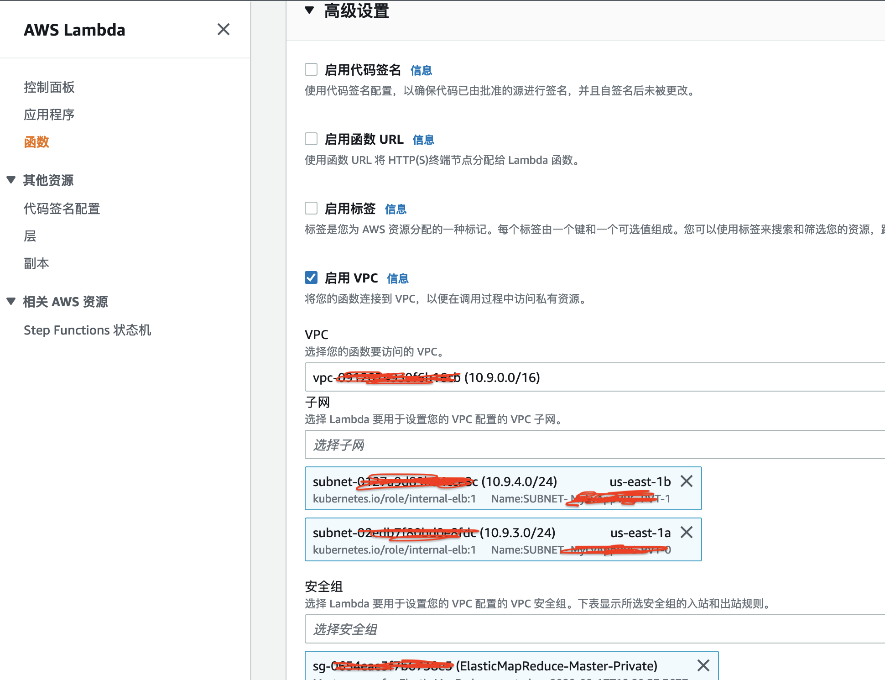
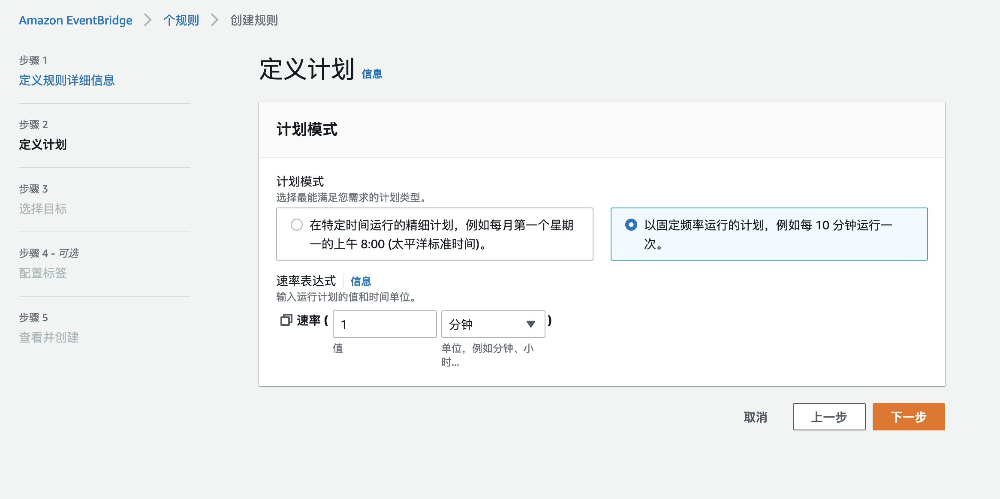

# AWS EMR Presto 集群自定义扩缩

基于 Presto 指标自动扩缩可以获得更好的查询性能并最大限度地降低成本。本项目通过EventBridge 定时调用AWS Ruby Lambda 获取EMR 集群信息及EMR Presto集群指标值，并发送到AWS CloudWatch上，当触发自定义扩缩告警策略时，执行EMR Presto集群的扩缩。
## 目录

- [AWS EMR Presto 集群自定义扩缩](#aws-emr-presto-集群自定义扩缩)
  - [目录](#目录)
    - [上手指南](#上手指南)
          - [配置要求](#配置要求)
          - [安装步骤](#安装步骤)
    - [文件目录说明](#文件目录说明)
    - [部署EMR Presto集群](#部署emr-presto集群)
    - [部署Lambda](#部署lambda)
      - [创建Lambda 执行角色](#创建lambda-执行角色)
      - [创建Lambda 函数](#创建lambda-函数)
    - [设置EventBridge](#设置eventbridge)
    - [使用到的框架](#使用到的框架)
    - [版本控制](#版本控制)
    - [作者](#作者)

### 上手指南

完成EMR Presto集群自动扩缩需要以下步骤：
1. 根据自定义扩展策略启动EMR Presto集群
2. EventBridge定时调用AWS Lambda
3. Lambda 获取EMR 集群信息和Presto指标值，并发送到CloudWatch上
4. CloudWatch告警触发AutoScalling

*由于一般EMR 集群部署在VPC私有子网中，为了Lambda能够访问集群指标，需要把Lambda也部署在VPC私有子网中，并且VPC有公有子网里部署了NAT能提供私有子网外出访问*

###### 配置要求

1. EMR 6.7.0
2. Lambda Ruby 2.7.0
3. AWS CLI 2.0

###### 安装步骤
```sh
git clone https://github.com/hillday/aws_emr_presto_custom_autoscalling.git
```

### 文件目录说明

```
aws_emr_presto_custom_autoscalling 
├── README.md
├── /images/
├── /emr/
│  │  ├── configurations.json # EMR Presto 配置文件
│  │  ├── create_cluster.sh # EMR 集群启动脚本
|  |  ├── instancegroupconfig.json # EMR 集群自定义扩缩策略配置
├── function.rb # lambda 函数
├── layer.zip # lambda 依赖层
```

### 部署EMR Presto集群
通过AWS CLI（需要有相应的权限）创建EMR Presto集群，进入`emr`目录执行创建集群脚本。
```sh
cd emr/
sh create_cluster.sh
```
*集群参数 `KeyName`,`SubnetId`,`EmrManagedMasterSecurityGroup`,`EmrManagedSlaveSecurityGroup` 根据需要进行设置*

创建成功后可以到控制台看到集群启动状态。

### 部署Lambda
Lambda 部署需要：
1. EMR、CloudWatch、EC2相关权限
2. 和EMR 集群一样的VPC和私有子网
3. 和EMR Master一样的安全组
4. presto相关依赖库（创建一个layer）

#### 创建Lambda 执行角色
1. 内联策略`EC2EMRInlinePolicy`

```json
{
    "Version": "2012-10-17",
    "Statement": [
        {
            "Effect": "Allow",
            "Action": "logs:CreateLogGroup",
            "Resource": "arn:aws:logs:REGION:ACCOUNT:*"
        },
        {
            "Effect": "Allow",
            "Action": [
                "logs:CreateLogStream",
                "logs:PutLogEvents"
            ],
            "Resource": [
                "arn:aws:logs:REGION:ACCOUNT:log-group:/aws/lambda/LAMBDANAME:*"
            ]
        },
        {
            "Effect": "Allow",
            "Action": [
                "ec2:DescribeNetworkInterfaces",
                "ec2:CreateNetworkInterface",
                "ec2:DeleteNetworkInterface",
                "ec2:DescribeInstances",
                "ec2:AttachNetworkInterface"
            ],
            "Resource": "*"
        }
    ]
}
```
*需要把json文档中的`REGION`,`ACCOUNT`,`LAMBDANAME`替换为实际的区域、账号、lambda函数名称*

2. 创建角色`EMRPrestoAutoscallingLambdaRole`


在IAM中选择Lambda服务创建角色，需要添加`CloudWatchFullAccess`,`AmazonEMRReadOnlyAccessPolicy_v2`权限和1中的内联策略。

#### 创建Lambda 函数
1. 创建`emr-presto-as-func-layer`层
    把`layer.zip`下载到本地或者上传到S3，用来创建Lambda层
    
    > 兼容架构选择 `x86_64`
    > 兼容运行时选择 `Ruby 2.7`

2. 创建`emr-presto-as-func`函数

    > 运行时选择 `Ruby 2.7`
    > 架构选择 `x86_64`
    > 角色选择一步创建的`EMRPrestoAutoscallingLambdaRole`

    
    > VPC 选择和EMR同一个VPC
    > 子网选择和EMR集群同一个子网，建议选2个以上（一个和EMR一样，一个可以不一样）
    > 安全组选择和EMR Master的一样（也可以不一样，需要EMR Master 安全组开放 Lambda 自定义安全组`8889`端口访问权限）

3. 为Lambda函数添加layer


选择之前创建的层即可

4. Lambda配置

    > 超时时间设置为1分钟

    
    > `MATCH_NAME` 匹配的EMR集群名称，表示哪些EMR集群会被采集信息，支持模糊匹配
    > `PRESTO_PORT` EMR Presto 指标访问端口，默认为`8889`
    > `REGION` 访问区域，默认为`us-east-1`

5. 更新Lambda代码
   把`function.rb`的代码更新到创建的函数`lambda_function`里去。通过测试验证函数是否可以正常执行。

### 设置EventBridge
通过EventBridge定时调用Lambda实现自动上报EMR Presto的自定义指标信息。
1. 创建规则`ScheduleEMRPrestoLambda`
   
2. 选择周期/频率(1分钟执行一次)
   
3. 选择目标（上一步创建的lambda）
   

### 使用到的框架

- [presto-metrics](https://github.com/xerial/presto-metrics)
- [presto-client](https://github.com/abicky/presto-client-ruby)

### 版本控制

该项目使用Git进行版本管理。您可以在repository参看当前可用版本。

### 作者

qchunhai
